# Maven y construcción de proyectos Java
## 1. Crear el primer proyecto Maven

### **Creación de la estructura del proyecto**
<br>

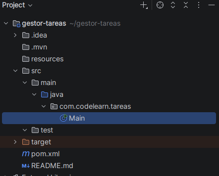

<br>
Añado el siguiente código en el pom.xml

```
<project xmlns="http://maven.apache.org/POM/4.0.0" xmlns:xsi="http://www.w3.org/2001/XMLSchema-instance" xsi:schemaLocation="http://maven.apache.org/POM/4.0.0 https://maven.apache.org/xsd/maven-4.0.0.xsd">
  <modelVersion>4.0.0</modelVersion>
  <groupId>com.codelearn</groupId>
  <artifactId>gestor-tareas</artifactId>
  <version>1.0.0-SNAPSHOT</version>
  <properties>
    <maven.compiler.release>21</maven.compiler.release>
    <project.build.sourceEncoding>UTF-8</project.build.sourceEncoding>
  </properties>
  <build>
    <plugins>
      <plugin>
        <groupId>org.apache.maven.plugins</groupId>
        <artifactId>maven-compiler-plugin</artifactId>
        <version>3.13.0</version>
      </plugin>
      <plugin>
        <groupId>org.apache.maven.plugins</groupId>
        <artifactId>maven-surefire-plugin</artifactId>
        <version>3.5.2</version>
      </plugin>
      <plugin>
        <groupId>org.apache.maven.plugins</groupId>
        <artifactId>maven-jar-plugin</artifactId>
        <version>3.4.2</version>
      </plugin>
    </plugins>
  </build>
</project>
````
<br>

En el Main.java añado un código de prueba


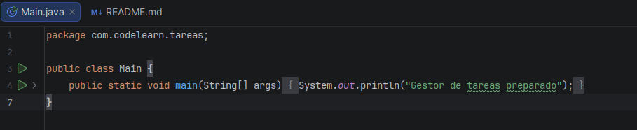


### **Ejercicio**

Si cambiamos el ``artifactId`` en el pom.xml Maven identificará el proyecto con las nuevas coordenadas. Para Maven, pasa a ser un artefacto distinto al original. 
Al ejecutar ``mvn validate`` se verifica únicamente que el proyecto esté correcto y que toda la información necesaria esté disponible.
Como el cambio de ``artifactId`` es sintácticamente válido, el comando terminará con un ``BUILD SUCCESS``.

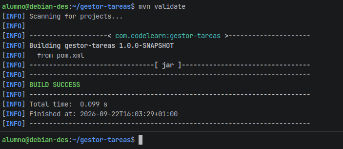

## 2. Compilar y entender los archivos generados

Si ejecuto:

```
mvn compile
java -cp target/classes com.codelearn.tareas.Main
```

Devuelve:

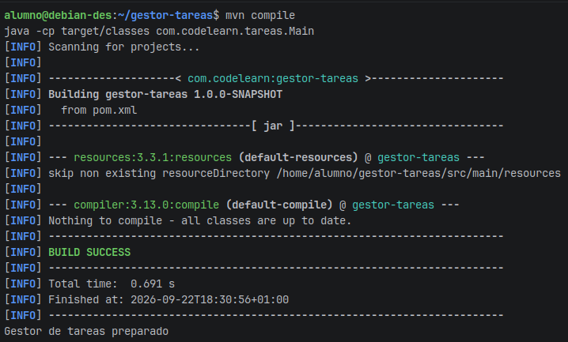


### **Ejercicio**

Si ejecuto ``mvn clean`` la carpeta ``target/`` desaparece.

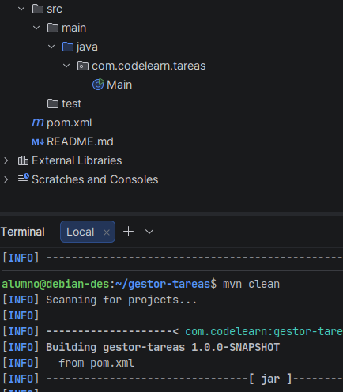

Si vuelvo a ejecutar ``mvn compile`` debe de reconstruirse de nuevo.

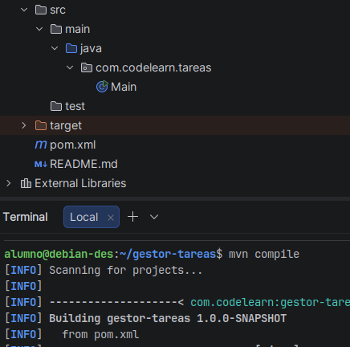


## 3. Ciclos de vida, fases y goals

Al ejecutar ``mvn clean package``, ``clean`` que pertenece a su propio ciclo, elimina resultados anteriores. ``package`` pertenece al ciclo ``default`` y alcanza todas las fases anteriores de ese ciclo.

Para un proyecto JAR, los enlaces habituales incluyen ``compiler:compile, surefire:test y jar:jar``.

### **Práctica integradora: preparar Linux y construir un proyecto Maven**

#### **Fase 1. Identificar el usuario y el entorno**

Primero utilizo los siguientes comandos:

```
whoami
pwd
java -version
javac -version
mvn -version
echo "$JAVA_HOME"
echo "$PATH"
```

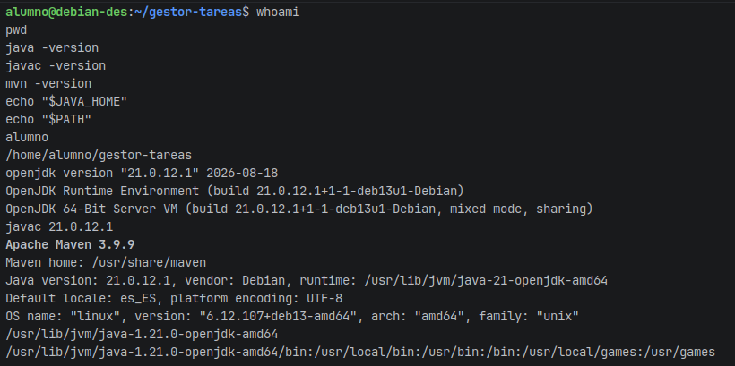


* `whoami` — Muestra el **usuario actual** del sistema.
* `pwd` — Muestra la **ruta de la carpeta** donde estás parado.
* `java -version` — Muestra la versión instalada del **entorno de ejecución (JRE)**.
* `javac -version` — Muestra la versión instalada del **compilador de Java (JDK)**.
* `mvn -version` — Muestra la versión instalada de **Apache Maven**.
* `echo "$JAVA_HOME"` — Muestra la **ruta de instalación** del JDK.
* `echo "$PATH"` — Muestra las **rutas del sistema** donde se buscan los comandos.

<br>

#### **Fase 2. Instalar una segunda versión del JDK**

A continuación voy a instalar la versión 17 Java con los siguientes comandos:

```
sudo apt update
sudo apt install openjdk-17-jdk
```

y compruebo que ambas versiones aparecen registradas:

```
update-alternatives --list java
update-alternatives --list javac
```

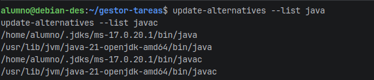

<br>

#### **Fase 3. Seleccionar el JDK activo**

Ahora voy a utilizar temporalmente JDK 17 para java y javac:

```
sudo update-alternatives --config java
sudo update-alternatives --config javac
```

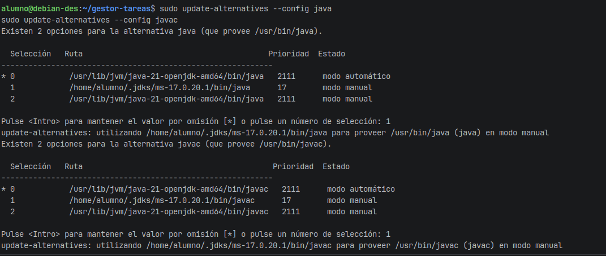

y configuro las variables de entorno de la sesión, sustituyendo la ruta por la que existe en mi máquina:

```
export JAVA_HOME=/home/alumno/.jdks/ms-17.0.20.1
export PATH="$JAVA_HOME/bin:$PATH"
```

Para comprobar el cambio:

```
java -version
javac -version
mvn -version
echo "$JAVA_HOME"
```

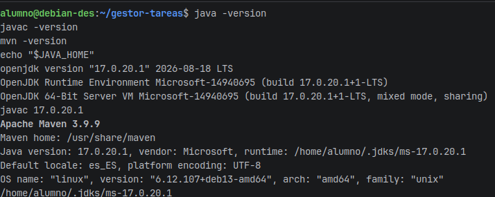

Por último, vuelvo a seleccionar JDK 21 y configuro sus variables

```
sudo update-alternatives --config java
sudo update-alternatives --config javac
export JAVA_HOME=/usr/lib/jvm/java-21-openjdk-amd64
export PATH="$JAVA_HOME/bin:$PATH"
```

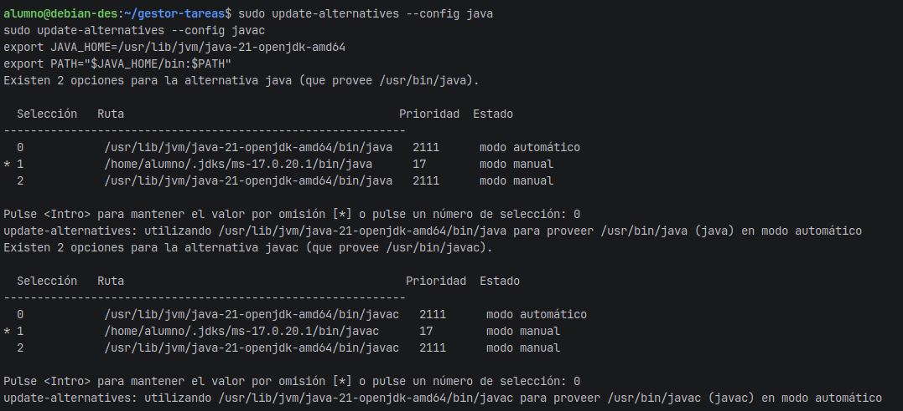

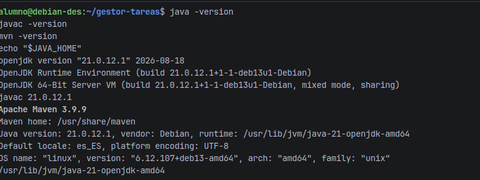

#### **Fase 4. Construir el proyecto**

Ejecuto un ``mvn clean verify`` que termina en un ``BUILD SUCCESS``, y compruebo que también Maven ha generado el resultado de construcción con ``find target -maxdepth 2 -type f | sort``

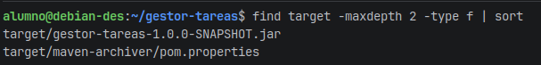


El archivo JAR generado es:

`target/gestor-tareas-1.0.0-SNAPSHOT.jar`

Al ejecutar `mvn verify`, Maven ejecuta todas las fases anteriores del ciclo de vida hasta llegar a `verify`:

- **validate:** comprueba que el proyecto es correcto.
- **compile:** compila el código fuente.
- **test:** ejecuta los tests.
- **package:** empaqueta la aplicación y genera el archivo JAR.
- **verify:** realiza las comprobaciones finales para verificar que el paquete es válido.

<br>

#### **Fase 5. Comprobar la relación entre JDK y Maven**

Para comprobar la relación entre JDK y Maven, selecciono de nuevo JDK 17 y ejecuto ``mvn clean verify``. 


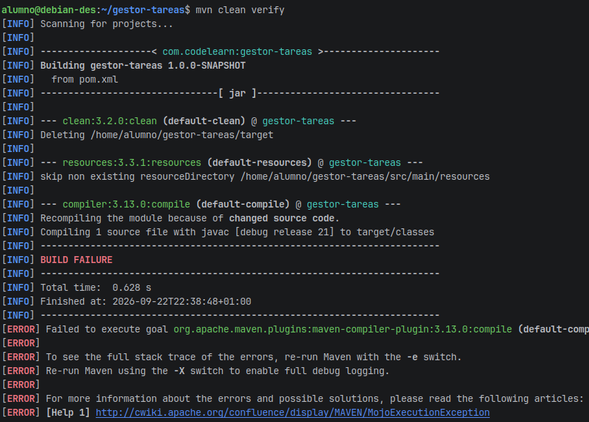

El proyecto falla porque el pom.xml solicita Java 21 mediante ``maven.compiler.release``

Si vuelvo  a seleccionar JDK 21 otra vez y ejecuto ``mvn clean verify``, la ejecución termina correctamente.

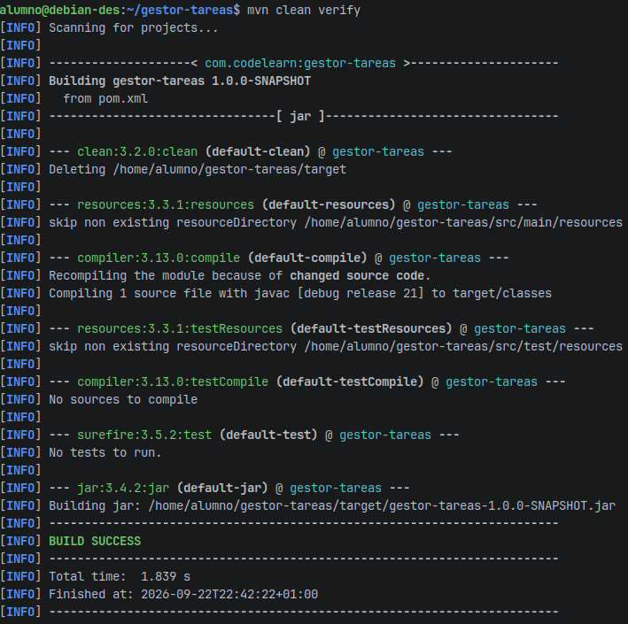

<br>

### **Añadir y utilizar una dependencia**

Añado en el pom.xml dentro de <project>, antes de <build>:

```
<dependencies>
  <dependency>
    <groupId>com.google.code.gson</groupId>
    <artifactId>gson</artifactId>
    <version>2.11.0</version>
  </dependency>
</dependencies>
```

y sustituyo el contenido de Main.java:

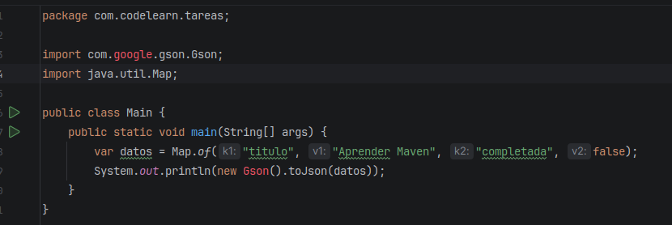

Luego ejecuto:

```
mvn compile
mvn dependency:tree
```

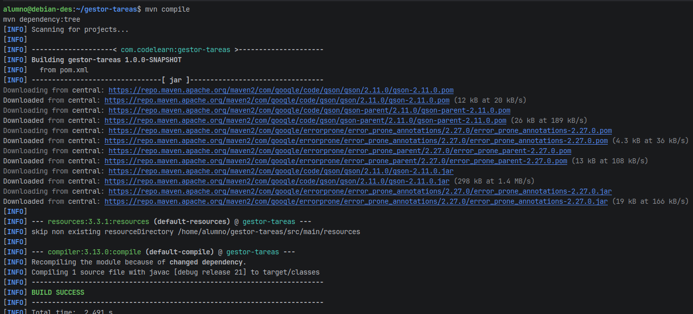


Maven descarga la biblioteca cuando la necesita. El árbol incluye ``com.google.code.gson:gson:jar:2.11.0:compile``. El scope por defecto es ``compile``.

### **Ejercicio**

Si cambio el título y recompilo: 

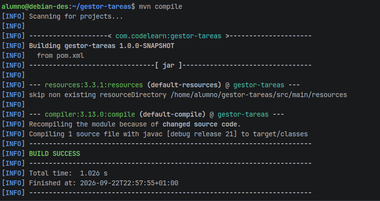

Si retiro temporalmente la dependencia: 

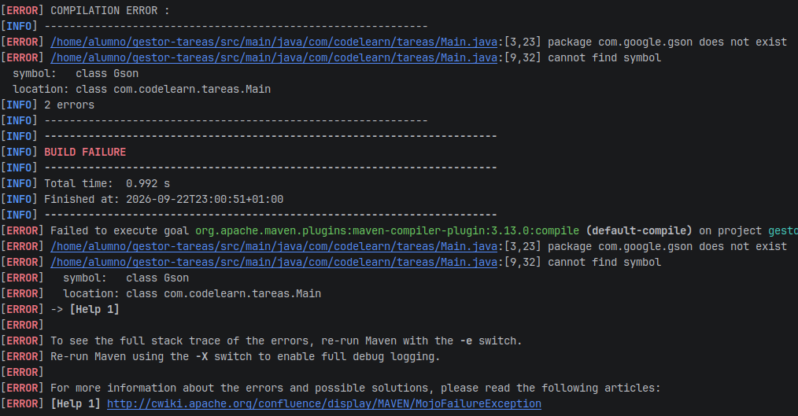

Gson es una biblioteca externa, por lo que Maven necesita tenerla indicada como dependencia en el archivo pom.xml.

<br>

### **Maven Central y el repositorio local**

Maven Central está disponible por defecto. La descarga termina en el repositorio local, normalmente en ``~/.m2/repository``

El pom.xml de una biblioteca permite conocer sus dependencias. La ruta refleja sus coordenadas.

Si hago ``mvn install``, Maven compila, prueba y empaqueta el proyecto, y además lo copia al repositorio local ``.m2``.


### **Ejercicio**

El pom.xml de Gson se encuentra en el repositorio local de Maven, dentro de:

`~/.m2/repository/com/google/code/gson/gson/2.11.0/gson-2.11.0.pom`

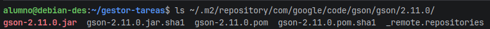

El pom.xml de nuestra aplicación se encuentra después de ejecutar `mvn install` en:

`~/.m2/repository/com/codelearn/gestor-tareas/1.0.0-SNAPSHOT/gestor-tareas-1.0.0-SNAPSHOT.pom`

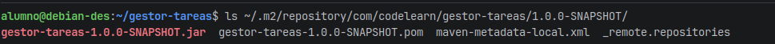

El comando `mvn install` no publica el proyecto para otras personas porque solamente instala el proyecto en el repositorio local de Maven del ordenador donde se ejecuta.

Por tanto, el proyecto queda disponible para otros proyectos Maven de ese mismo ordenador, pero no se sube a Internet ni a un repositorio remoto.

Para que otras personas puedan utilizarlo, habría que publicarlo en un repositorio remoto, como Maven Central o un repositorio privado de una empresa.

<br>

### **Repositorios externos y settings.xml**

El pom.xml expresa las necesidades del proyecto. ``settings.xml`` contiene configuración del entorno, como servidores, proxy, mirrors y perfiles. No se crea automáticamente en todas las instalaciones.

Creo una carpeta config en el proyecto y guardo sin credenciales ``config/settings-publico.xml`` con:

```
<settings xmlns="http://maven.apache.org/SETTINGS/1.2.0"
          xmlns:xsi="http://www.w3.org/2001/XMLSchema-instance"
          xsi:schemaLocation="http://maven.apache.org/SETTINGS/1.2.0 https://maven.apache.org/xsd/settings-1.2.0.xsd">
  <profiles>
    <profile>
      <id>repositorio-publico</id>
      <repositories>
        <repository>
          <id>central-explicito</id>
          <url>https://repo.maven.apache.org/maven2</url>
          <releases><enabled>true</enabled></releases>
          <snapshots><enabled>false</enabled></snapshots>
        </repository>
      </repositories>
    </profile>
  </profiles>
</settings>
```

Si ejecuto:

```
mvn -s config/settings-publico.xml -Prepositorio-publico help:active-profiles
mvn -s config/settings-publico.xml -Prepositorio-publico compile
```

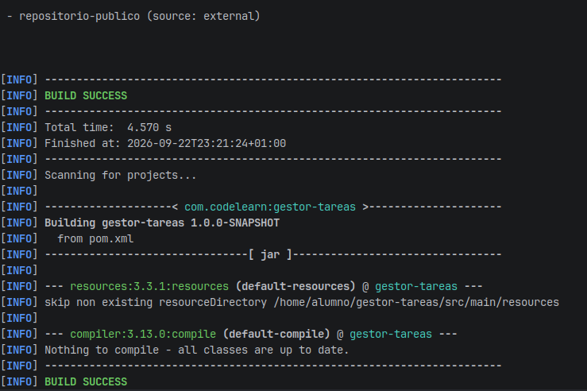

aparece ``repositorio-publico`` entre los perfiles activos. 

``-s``selecciona el archivo de configuración del usuario; no reemplaza el pom.xml ni elimina necesariamente los settings globales.


### **Ejercicio**

Con el comando:

`mvn -s config/settings-publico.xml -Prepositorio-publico help:active-profiles`

se activa el perfil `repositorio-publico`, por lo que aparece entre los perfiles activos.

Al ejecutar:

`mvn -s config/settings-publico.xml -Prepositorio-publico compile`

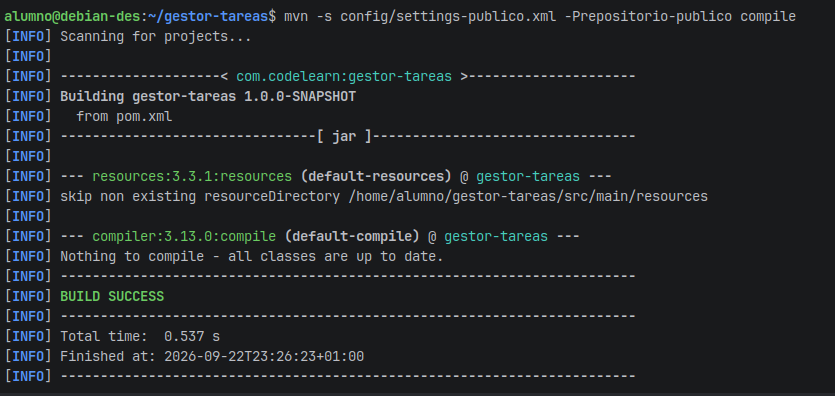

el proyecto se compila correctamente utilizando la configuración del archivo `settings-publico.xml`.

Después se ejecutó la misma comprobación sin `-Prepositorio-publico`. En este caso, el perfil `repositorio-publico` no se activa, porque no se ha indicado mediante la opción `-P`.

Sin embargo, el proyecto puede seguir descargando dependencias y compilándose correctamente porque Maven utiliza Central como repositorio por defecto. Por tanto, el perfil creado sirve para añadir explícitamente ese repositorio, pero no es necesario para utilizar Central en un proyecto Maven normal.

<br>

### **Repositorios privados, mirrors y proxy**

Guardo fuera de Git un archivo ``settings-empresa.xml``

```
<settings xmlns="http://maven.apache.org/SETTINGS/1.2.0">
  <servers>
    <server>
      <id>empresa</id>
      <username>${env.MAVEN_REPO_USER}</username>
      <password>${env.MAVEN_REPO_TOKEN}</password>
    </server>
  </servers>
  <mirrors>
    <mirror>
      <id>empresa</id>
      <mirrorOf>*</mirrorOf>
      <url>https://repo.empresa.example/repository/maven-public/</url>
    </mirror>
  </mirrors>
</settings>
```
Se define ``MAVEN_REPO_USER`` y ``MAVEN_REPO_TOKEN`` en el entorno mediante un gestor de secretos o el mecanismo de CI. En una terminal, se puede asignar para la sesión con export.

``mvn -s settings-empresa.xml clean verify``

El ``<server><id>`` debe coincidir con el identificador del mirror, porque Maven termina conectándose a él. 

``mirrorOf=*`` dirige todos los repositorios al servicio y el mirror debe proporcionar los artefactos solicitados. 

Un mirror no une por sí mismo varios repositorios: esa agrupación la realiza Nexus o Artifactory.

Si la red requiere un proxy, añado a ``<settings>`` este bloque:

```
<proxies>
  <proxy>
    <id>red-empresa</id>
    <active>true</active>
    <protocol>http</protocol>
    <host>proxy.empresa.example</host>
    <port>8080</port>
    <nonProxyHosts>localhost|127.0.0.1|*.empresa.example</nonProxyHosts>
  </proxy>
</proxies>
```

El protocolo corresponde al proxy. Si requiere autenticación, se utiliza ``<username>`` y ``<password>`` con variables de entorno, igual que en el servidor

### **Ejercicio**

El identificador del mirror utilizado es:

`empresa`

La URL configurada en el ejemplo es:

`https://repo.empresa.example/repository/maven-public/`

Esta URL es un marcador de ejemplo y debe sustituirse por la URL real proporcionada por el administrador del servicio Nexus o Artifactory.

No se incluyen credenciales ni tokens en la configuración versionada. Las variables `MAVEN_REPO_USER` y `MAVEN_REPO_TOKEN` se utilizan para proporcionar las credenciales de forma segura.

En este caso, no se dispone de un servicio privado Nexus o Artifactory ni de una cuenta autorizada, por lo que la práctica de conexión queda pendiente hasta disponer de acceso.

<br>

### **Profiles: activar configuraciones de Maven**

Añado este bloque bajo ``<project>``, después de ``<build>``:

```
<profiles>
  <profile>
    <id>distribucion</id>
    <build>
      <plugins>
        <plugin>
          <groupId>org.apache.maven.plugins</groupId>
          <artifactId>maven-shade-plugin</artifactId>
          <version>3.6.0</version>
          <executions>
            <execution>
              <phase>package</phase>
              <goals><goal>shade</goal></goals>
              <configuration>
                <shadedArtifactAttached>true</shadedArtifactAttached>
                <shadedClassifierName>all</shadedClassifierName>
                <createDependencyReducedPom>false</createDependencyReducedPom>
                <transformers>
                  <transformer implementation="org.apache.maven.plugins.shade.resource.ManifestResourceTransformer">
                    <mainClass>com.codelearn.tareas.Main</mainClass>
                  </transformer>
                </transformers>
              </configuration>
            </execution>
          </executions>
        </plugin>
      </plugins>
    </build>
  </profile>
  <profile>
    <id>informe</id>
    <properties>
      <maven.compiler.showWarnings>true</maven.compiler.showWarnings>
    </properties>
  </profile>
</profiles>
```

Luego ejecuto:

```
mvn clean package
mvn -Pdistribucion clean package
java -jar target/gestor-tareas-1.0.0-SNAPSHOT-all.jar
mvn -Pdistribucion,informe clean verify
mvn -Pdistribucion help:active-profiles
mvn -Pdistribucion help:effective-pom
```

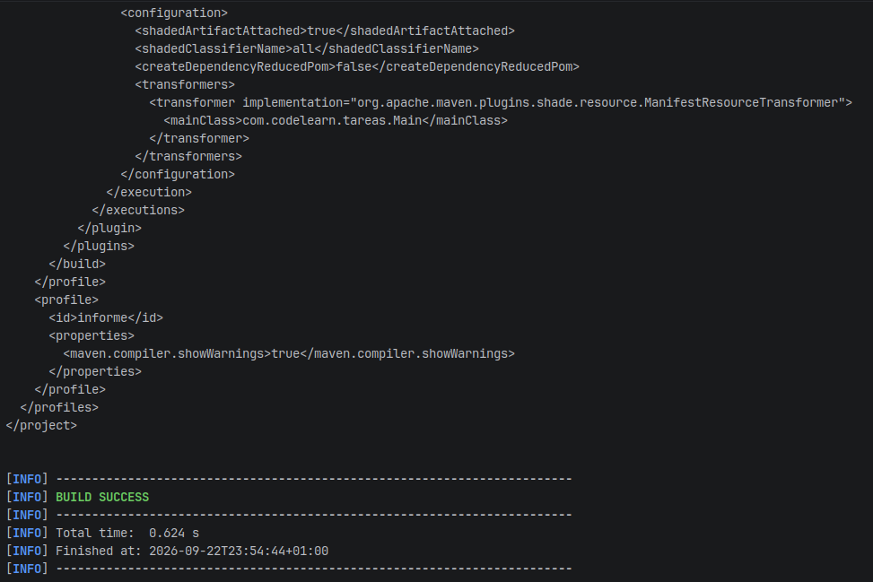

El build normal genera el JAR convencional. El perfil distribucion genera además un JAR -all con dependencias y manifiesto ejecutable

Dentro de un perfil se puede añadir una de estas activaciones, según el caso:

``<activation><property><name>informe</name><value>true</value></property></activation>``

Se activa con ``mvn -Dinforme=true compile``

Los perfiles del pom.xml pueden modificar dependencias, plugins y construcción. Los perfiles de settings admiten propiedades y repositorios, incluidos los de plugins.


### **Ejercicio**

Añado la activación por propiedad al perfil informe:

```
<profile>
  <id>informe</id>
  <activation>
    <property>
      <name>informe</name>
      <value>true</value>
    </property>
  </activation>
  <properties>
    <maven.compiler.showWarnings>true</maven.compiler.showWarnings>
  </properties>
</profile>
```

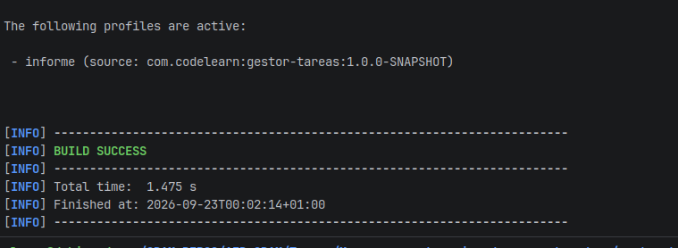

El perfil ``informe`` debe aparecer como activo. 

El perfil ``distribucion`` se mantiene optativo y no se modifica.


<br>

### **Dependencias transitivas, scopes y conflictos**

Las dependencias transitivas llegan a través de otras bibliotecas. Maven elige una versión cuando coinciden varias rutas al mismo artefacto.

Ejecuto:

```
mvn dependency:tree
mvn dependency:tree -Dverbose
```

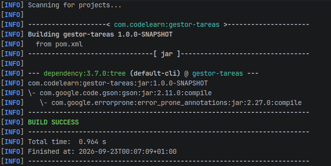

Para observar un caso claro, añado temporalmente a ``<dependencies>``:

```
<dependency>
  <groupId>org.apache.commons</groupId>
  <artifactId>commons-text</artifactId>
  <version>1.12.0</version>
</dependency>
<dependency>
  <groupId>org.apache.commons</groupId>
  <artifactId>commons-lang3</artifactId>
  <version>3.14.0</version>
</dependency>
```

y vuelvo a ejecutar:

``mvn dependency:tree -Dverbose -Dincludes=org.apache.commons``

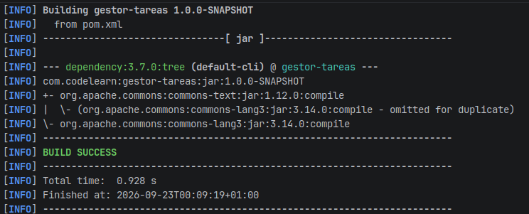

``commons-text`` solicita transitivamente otra versión de ``commons-lang3``; la declaración directa tiene menor profundidad y gana la mediación. 

Maven no escoge necesariamente la versión más reciente. A igual profundidad suele prevalecer la primera declaración.

El scope afecta a los classpaths y a cómo se propagan las dependencias. No implica que todas se introduzcan físicamente en el JAR convencional.

Una exclusión se declara dentro de la dependencia por la que llega una biblioteca:

```
<exclusions>
  <exclusion>
    <groupId>org.apache.commons</groupId>
    <artifactId>commons-lang3</artifactId>
  </exclusion>
</exclusions>
```

### **Ejercicio**

En el pom.xml, elimino temporalmente la dependencia directa de ``commons-lang3``:

```
<dependency>
  <groupId>org.apache.commons</groupId>
  <artifactId>commons-lang3</artifactId>
  <version>3.14.0</version>
</dependency>
```

Compruebo el árbol de dependencias con:

``mvn dependency:tree -Dverbose -Dincludes=org.apache.commons``

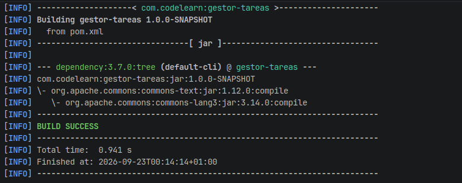

Ahora ``commons-lang3`` llega como dependencia transitiva de ``commons-text``.

Si vuelvo a añadir la dependencia directa de ``commons-lang3`` y compruebo de nuevo:

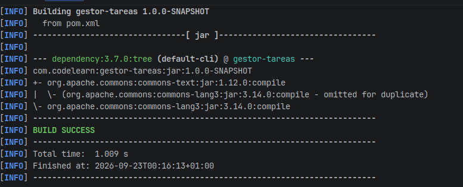

Si elimino las dos dependencias:

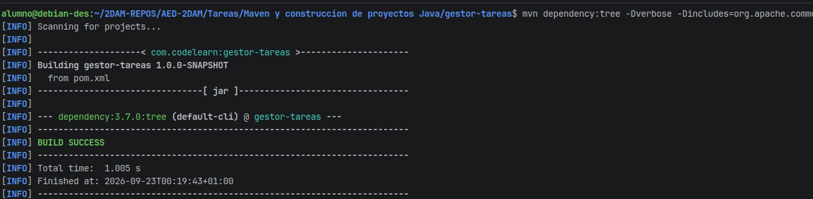

<br>

### **Propiedades y gestión de versiones**

Añado a ``<properties>``:

```
<gson.version>2.11.0</gson.version>
<junit.version>5.11.0</junit.version>
<maven-compiler-plugin.version>3.13.0</maven-compiler-plugin.version>
<maven-surefire-plugin.version>3.5.2</maven-surefire-plugin.version>
<maven-jar-plugin.version>3.4.2</maven-jar-plugin.version>
<maven-shade-plugin.version>3.6.0</maven-shade-plugin.version>
<maven-dependency-plugin.version>3.8.1</maven-dependency-plugin.version>
<maven-wrapper-plugin.version>3.3.2</maven-wrapper-plugin.version>
```

En la dependencia Gson sustituyo la versión por ``<version>${gson.version}</version>`` y ejecuto ``mvn compile``.

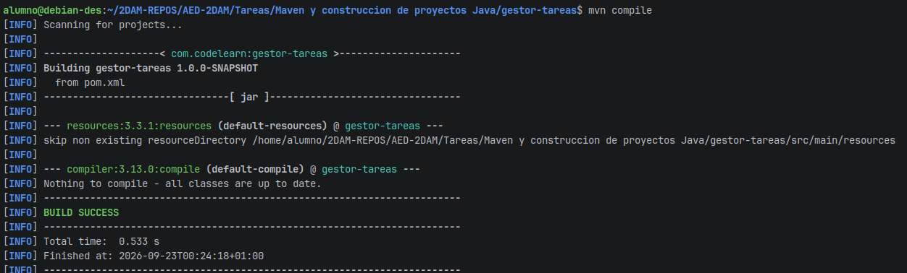

Para separar la política de versiones de las bibliotecas utilizadas, añado bajo ``<project>``:

```
<dependencyManagement>
  <dependencies>
    <dependency>
      <groupId>com.google.code.gson</groupId>
      <artifactId>gson</artifactId>
      <version>${gson.version}</version>
    </dependency>
    <dependency>
      <groupId>org.junit</groupId>
      <artifactId>junit-bom</artifactId>
      <version>${junit.version}</version>
      <type>pom</type>
      <scope>import</scope>
    </dependency>
  </dependencies>
</dependencyManagement>
```

Retiro ``<version>`` únicamente de Gson en el bloque normal ``<dependencies>`` y la versión la aporta ahora ``dependencyManagement``. El BOM alinea las versiones de los artefactos JUnit.

Ahora declaro las versiones de dependencias y plugins mediante propiedades. Si una dependencia recibe su versión de ``dependencyManagement`` o de un pom.xml, hay que omitir su ``<version>`` en ``<dependencies>``; la versión gestionada debe partir de una propiedad.

En los plugins existentes de ``<build><plugins>``, sustituyo sus versiones por:

```
<!-- maven-compiler-plugin -->
<version>${maven-compiler-plugin.version}</version>
<!-- maven-surefire-plugin -->
<version>${maven-surefire-plugin.version}</version>
<!-- maven-jar-plugin -->
<version>${maven-jar-plugin.version}</version>
```

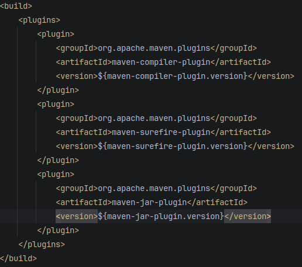

En el plugin Shade del perfil distribucion, utilizo ``<version>${maven-shade-plugin.version}</version>``.

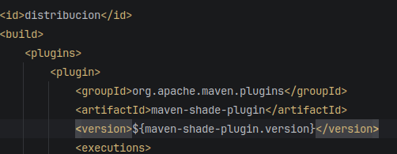

También añado estos dos plugins al bloque principal ``<build><plugins>`` para que los comandos posteriores utilicen las versiones declaradas:

```
<plugin>
  <groupId>org.apache.maven.plugins</groupId>
  <artifactId>maven-dependency-plugin</artifactId>
  <version>${maven-dependency-plugin.version}</version>
</plugin>
<plugin>
  <groupId>org.apache.maven.plugins</groupId>
  <artifactId>maven-wrapper-plugin</artifactId>
  <version>${maven-wrapper-plugin.version}</version>
</plugin>
```

### **Ejercicio**

Ejecuto:

``mvn help:effective-pom -Doutput=target/pom-efectivo.xml``

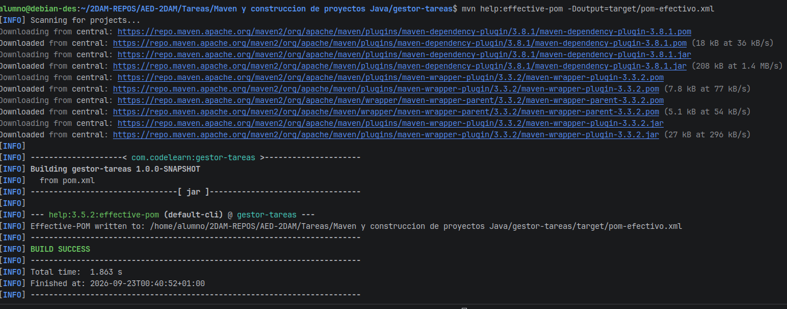

En en ``target/pom-efectivo.xml`` debe aparecer:

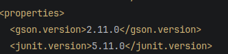

<br>

### **Añadir y ejecutar pruebas con JUnit**

Añado dentro del bloque normal ``<dependencies>``:

```
<dependency>
  <groupId>org.junit.jupiter</groupId>
  <artifactId>junit-jupiter</artifactId>
  <scope>test</scope>
</dependency>
```

La versión procede del BOM. 

Ahora creo un ``src/main/java/com/codelearn/tareas/GestorTareas.java``:

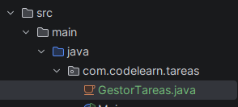

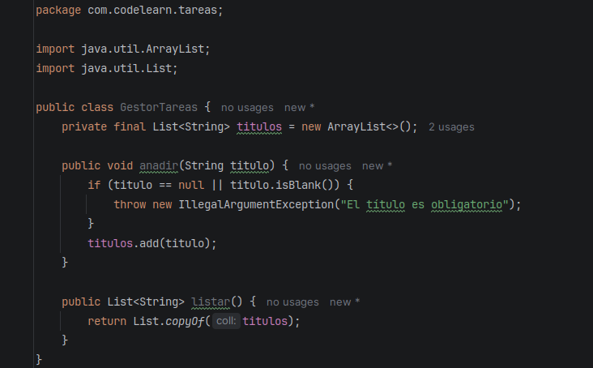

y un ``src/test/java/com/codelearn/tareas/GestorTareasTest.java``:

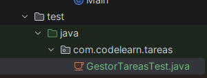

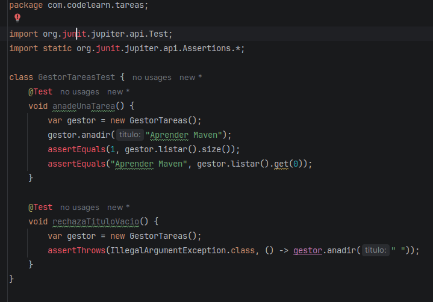

Ejecuto:

```
mvn test
mvn -Dtest=GestorTareasTest test
```

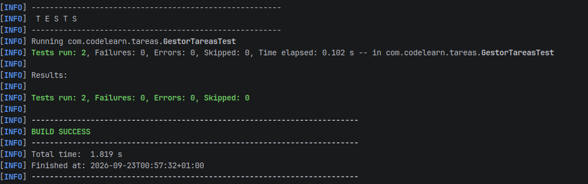

Los informes se guardan en ``target/surefire-reports/``.


### **Ejercicio**

Añado estas dos pruebas a ``GestorTareasTest.java``:

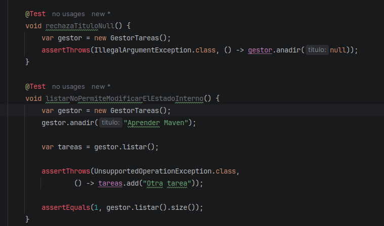

Ejecuto ``mvn test``:

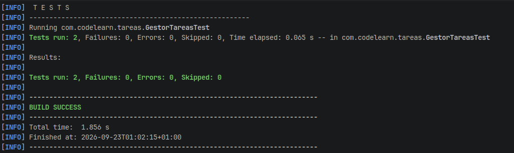

<br>

### **El build como comprobación de calidad**

### **Ejercicio**

Ejecuto ``mvn clean verify``

Debe ejecutar las pruebas y generar el JAR.

Si cambio algo temporalmente en ``GestorTareas.java`` por algo que no compile:

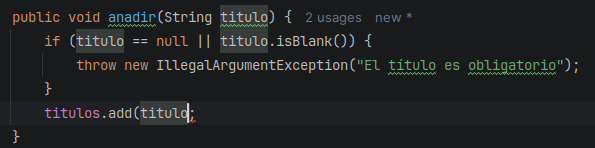

y ejecuto de nuevo ``mvn clean verify``: 

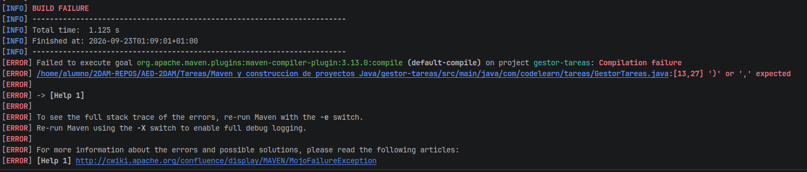

Maven no llegará a ejecutar las pruebas, porque el código no puede compilar.

Si provoca un fallo en una prueba haciendo un cambio temporal: 

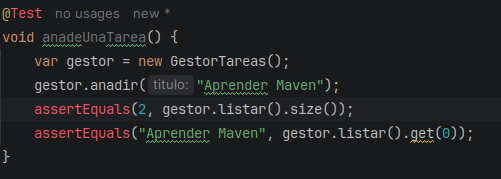

y ejecuto de nuevo ``mvn clean verify``:

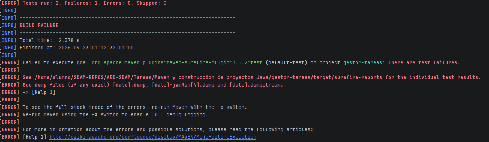

Esta vez el proyecto sí compila, pero una prueba falla. La primera causa relevante es que la aserción esperaba 2, mientras que el método realmente devuelve 1.

<br>

### **Recursos y configuración de la aplicación**

Creo ``src/main/resources/aplicacion.properties``:

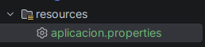

y añado ``nombre=Gestor de tareas`` en él

Sustituyo ``Main.java`` por este ejemplo, que conserva Gson:

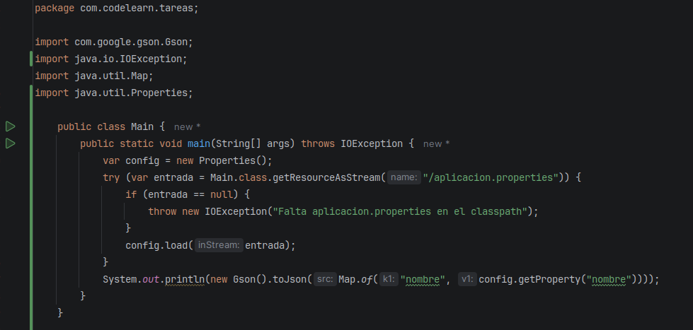

Luego ejecuto:

```
mvn clean package
jar tf target/gestor-tareas-1.0.0-SNAPSHOT.jar
```

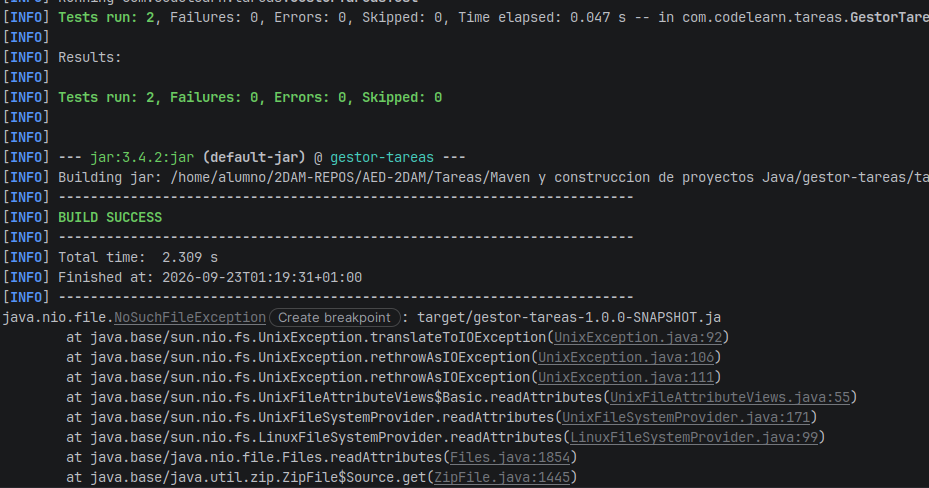

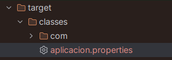


### **Ejercicio**

Cambio ``nombre=Gestor de tareas`` por ``nombre=Mi gestor de tareas``

Después ejecuto ``mvn clean package`` y comprueba que el recurso está dentro del JAR con ``jar tf target/gestor-tareas-1.0.0-SNAPSHOT.jar``

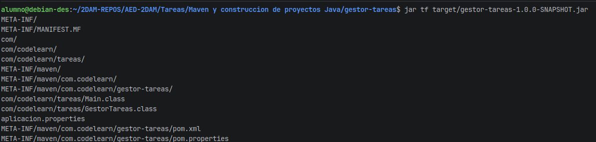

Ahora ejecuto ``java -jar target/gestor-tareas-1.0.0-SNAPSHOT-all.jar`` para comprobar que el JAR utiliza el recurso actualizado:

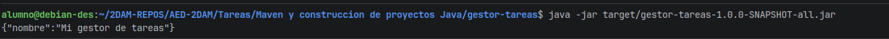

Si muevo temporalmente el archivo ``src/main/resources/aplicacion.properties`` fuera del proyecto y ejecuto ``mvn clean package`` y ``java -jar target/gestor-tareas-1.0.0-SNAPSHOT-all.jar``

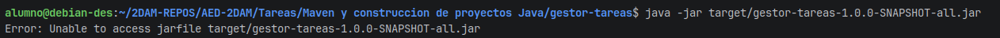

la aplicación falla porque ``Main.class.getResourceAsStream("/aplicacion.properties")`` ya no encuentra el recurso en el classpath.

<br>

### **Empaquetar y ejecutar la aplicación**

Dentro del plugin ``maven-jar-plugin`` existente añado:

```
<configuration>
  <archive>
    <manifest>
      <mainClass>com.codelearn.tareas.Main</mainClass>
    </manifest>
  </archive>
</configuration>
```

y ejecuto:

```
mvn clean package
jar tf target/gestor-tareas-1.0.0-SNAPSHOT.jar
mvn dependency:copy-dependencies -DincludeScope=runtime -DoutputDirectory=target/lib
```

y luego:

```
java -cp "target/gestor-tareas-1.0.0-SNAPSHOT.jar:target/lib/*" com.codelearn.tareas.Main
```

Debe imprimirse un JSON cuyo nombre sea 'Gestor de tareas':

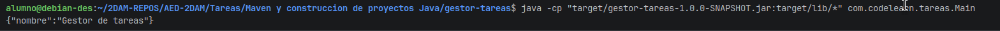

``Main-Class`` permite a ``java -jar`` saber dónde empezar, pero no incorpora Gson. Para este proyecto, ejecutar el JAR convencional con ``java -jar`` sin configurar bibliotecas puede producir ``NoClassDefFoundError``.

Ejecutando:

```
mvn -Pdistribucion clean package
java -jar target/gestor-tareas-1.0.0-SNAPSHOT-all.jar
```

El JAR -all sí incluye las bibliotecas.

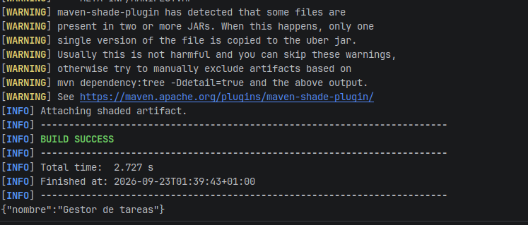

### **Ejercicio**

Para generar el JAR convencional y las dependencias primero ejecuto:

```
mvn clean package
mvn dependency:copy-dependencies -DincludeScope=runtime -DoutputDirectory=target/lib
```

y compruebo:

```
ls target
ls target/lib
```

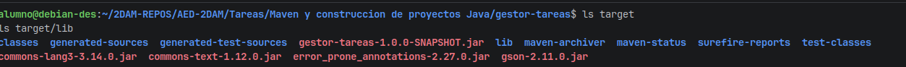

Ahora se puede comprobar que el JAR convencional ya tiene ``Main-Class``:

``java -jar target/gestor-tareas-1.0.0-SNAPSHOT.jar``


Para copiar todo a otra carpeta ejecuto:

```
rm -rf prueba-distribucion
mkdir -p prueba-distribucion/lib
```

copio el JAR:

``cp target/gestor-tareas-1.0.0-SNAPSHOT.jar prueba-distribucion/``

y compruebo:

```
ls prueba-distribucion
ls prueba-distribucion/lib
```

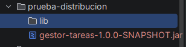

Luego dentro de la carpeta ejecuto el programa utilizando el classpath ajustado:

``java -cp "gestor-tareas-1.0.0-SNAPSHOT.jar:lib/*" com.codelearn.tareas.Main``

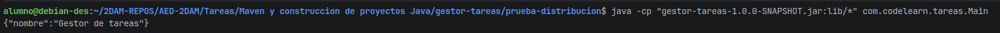

Para el JAR ``-all`` genera la distribución ``mvn -Pdistribucion clean package`` y compruebo ``ls target/*all.jar``

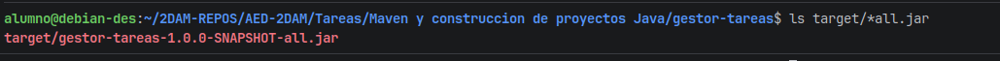

Creo otra carpeta 

```
rm -rf prueba-all
mkdir prueba-all
cp target/gestor-tareas-1.0.0-SNAPSHOT-all.jar prueba-all/
cd prueba-all
```

y ejecuto solamente el JAR:

``java -jar gestor-tareas-1.0.0-SNAPSHOT-all.jar``

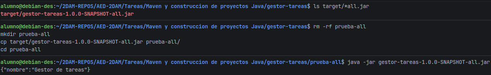